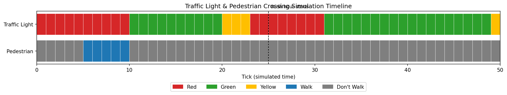

# Traffic Light & Pedestrian Crossing Simulator

A Python simulation of a traffic light system with pedestrian crossing logic, modeled as a finite state machine.

## Why I Built This

As an incoming Computer Engineering student at the University of Manitoba, I wanted a project that would help me practice core embedded-systems concepts — finite state machines, timing logic, and event-driven behavior — before starting coursework in control systems (ECE 2220/2262). Traffic light systems are a classic real-world example of this kind of logic.

## What It Does

- Models a traffic light cycling through RED → GREEN → YELLOW states with configurable durations
- Supports two timing profiles: **normal** and **rush hour** (longer green lights), switchable at runtime
- Models a pedestrian crossing signal (WALK / DON'T WALK) that responds to a pedestrian pressing a crossing button
- Ensures pedestrians can only be given a WALK signal when the traffic light is RED (a basic safety constraint)
- Gives pedestrians a fixed WALK duration, rather than walking for the entire red light — matching how real pedestrian signals work
- Handles edge cases: repeated button presses, a pending request that waits patiently for the next red light, and a light change cutting a walk signal short
- Runs a tick-based simulation (each "tick" represents one time step) and prints the state of both systems over time

## How to Run It

```bash
python3 main.py
```

To generate a visual timeline chart (saved as `simulation_timeline.png`):

```bash
python3 visualize.py
```

To run the unit tests:

```bash
python -m unittest tests/test_traffic_controller.py -v
```

## Example Output

Running `visualize.py` produces a timeline chart like this, showing the full RED → GREEN → YELLOW cycle, the pedestrian WALK signal, and the moment rush hour timing kicks in:



## Project Structure

```
traffic-light-simulator/
├── README.md
├── traffic_controller.py   # Core traffic light state machine
├── pedestrian_crossing.py  # Pedestrian signal logic
├── main.py                 # Runs the text-based simulation
├── visualize.py             # Generates a visual timeline chart
└── tests/
    └── test_traffic_controller.py
```

## What I'd Extend Next

- Multiple intersections coordinating with each other
- Variable timing based on time of day (e.g., rush hour vs. off-peak)
- A visual (graphical) representation instead of text output

## Author

Alvaro Oda — Computer Engineering student, University of Manitoba
